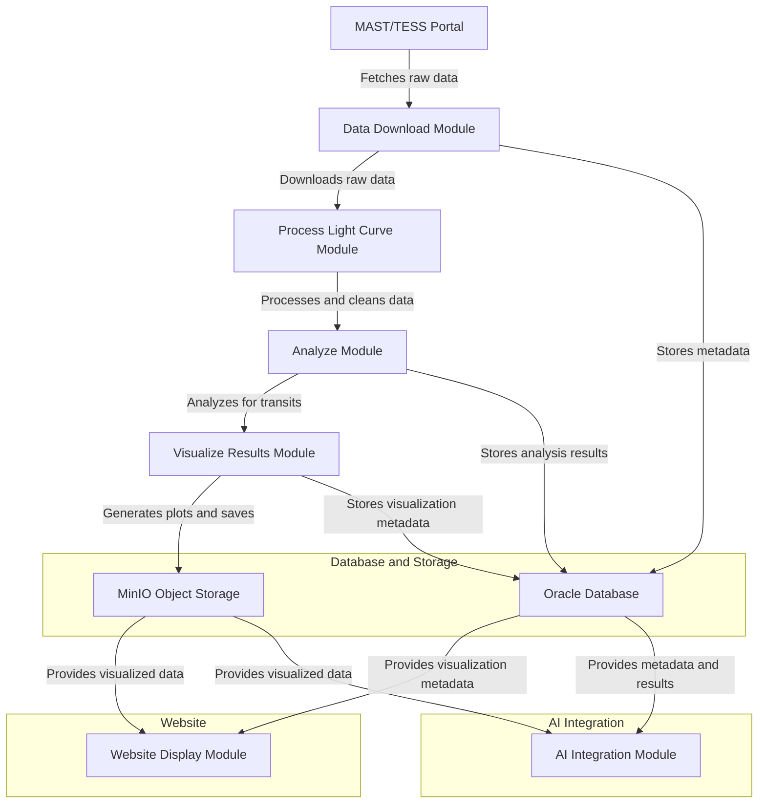

# Exoplanet Transit Detector

This repository contains a Python-based project for detecting exoplanet transits using light curve data from the TESS and Kepler missions. The project is modular, scalable, and designed for advanced astronomical data analysis.

## Features
- **Data Fetching**: Automatically downloads raw light curve data from the MAST/TESS portal.
- **Data Processing**: Cleans and processes raw light curve data to highlight transit signals.
- **Transit Detection**: Detects potential exoplanet transits using the Box Least Squares (BLS) algorithm.
- **Visualization**: Generates visual plots of raw and processed data, along with transit metrics.
- **Database and Storage**: Uses Oracle Database for metadata and MinIO Object Storage for visualizations.
- **Web Integration**: Displays results dynamically on a website.
- **AI Integration (Planned)**: Incorporates machine learning for exoplanet classification and prediction.

## Architecture
The project follows a modular architecture:



## Installation

### Prerequisites
- Python 3.8+
- Virtual environment tools (e.g., `venv`, `conda`)
- Oracle Database (optional for metadata storage)
- MinIO Object Storage (optional for visualization storage)

### Steps
1. Clone the repository:
   ```bash
   git clone https://github.com/yourusername/exoplanet-transit-detector.git
   cd exoplanet-transit-detector
   ```
2. Create and activate a virtual environment:
   ```bash
   python3 -m venv venv
   source venv/bin/activate  # For Unix/Mac
   venv\Scripts\activate   # For Windows
   ```
3. Install required libraries:
   ```bash
   pip install -r requirements.txt
   ```
4. Configure the project:
   - Edit `config.json` to specify your database, storage, and analysis preferences.

## Usage

### 1. Fetch Star IDs
Run the script to fetch star IDs from the TESS catalog:
```bash
python Data_Download_Module/scripts/fetch_star_ids.py
```

### 2. Fetch Light Curve Data
Download raw light curve data for the fetched star IDs:
```bash
python Data_Download_Module/scripts/fetch_star_data.py
```

### 3. Process Light Curves
Clean and process raw light curve data:
```bash
python Process_Light_Curve_Module/scripts/process_lightcurve.py
```

### 4. Analyze for Transits
Analyze processed light curves for potential transits:
```bash
python Analyze_Module/scripts/analyze_transits.py
```

### 5. Visualize Results
Generate visualizations for detected transits:
```bash
python visualize_transits_module/scripts/generate_plot.py <path_to_results_file>
```

## Configuration
Key settings can be modified in `config.json`:
- **Catalog Query**: Define star brightness range and catalog parameters.
- **Data Paths**: Specify directories for raw, processed, and visualized data.
- **BLS Parameters**: Customize the period and duration ranges for transit detection.

## Contributing
Contributions are welcome! Please follow these steps:
1. Fork the repository.
2. Create a new branch (`git checkout -b feature-branch`).
3. Commit your changes (`git commit -m "Add new feature"`).
4. Push to your branch (`git push origin feature-branch`).
5. Create a pull request.

## License
This project is licensed under the MIT License. See the `LICENSE` file for details.

## Acknowledgments
- [Lightkurve](https://lightkurve.org/): For light curve analysis.
- [Astroquery](https://astroquery.readthedocs.io/): For querying astronomical databases.
- [Matplotlib](https://matplotlib.org/): For data visualization.

## Contact
For any questions or suggestions, feel free to reach out:
- **Email**: simran.proton@yahoo.com
- **GitHub**: https://github.com/Downforcedemon
